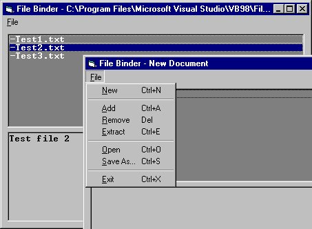



## Bind unlimited number of files into 1 like \*\.PAK files\(Hl, Q2 ect\.\.\)\(No compression\)\.\*FIXED\*

### Description

Binds a unlimited number of files into 1.
 
### More Info
 
This thing may not be very memory efficent but it works! Anyway i does not support compression. If anybody knows anything about file compression plz lemme know! thnx and please tell me how i can improve code. I would like to use this on any future games or something.

             |
---                |---
**Submitted On**   |2003-01-04 10:38:34
**By**             |[Jimmy Kelly](https://github.com/Planet-Source-Code/PSCIndex/blob/master/ByAuthor/jimmy-kelly.md)
**Level**          |Beginner
**User Rating**    |3.8 (15 globes from 4 users)
**Compatibility**  |VB 6\.0
**Category**       |[Files/ File Controls/ Input/ Output](https://github.com/Planet-Source-Code/PSCIndex/blob/master/ByCategory/files-file-controls-input-output__1-3.md)
**World**          |[Visual Basic](https://github.com/Planet-Source-Code/PSCIndex/blob/master/ByWorld/visual-basic.md)
**Archive File**   |[Bind\_unlim152389142003\.zip](https://github.com/Planet-Source-Code/jimmy-kelly-bind-unlimited-number-of-files-into-1-like-pak-files-hl-q2-ect-no-compression-__1-42171/archive/master.zip)

